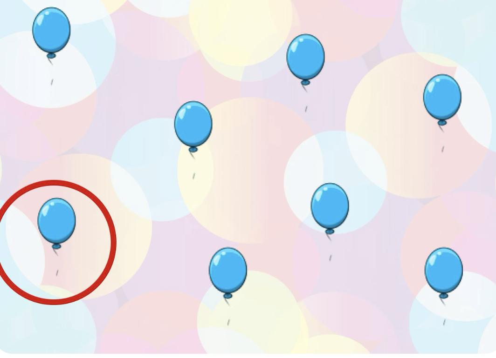
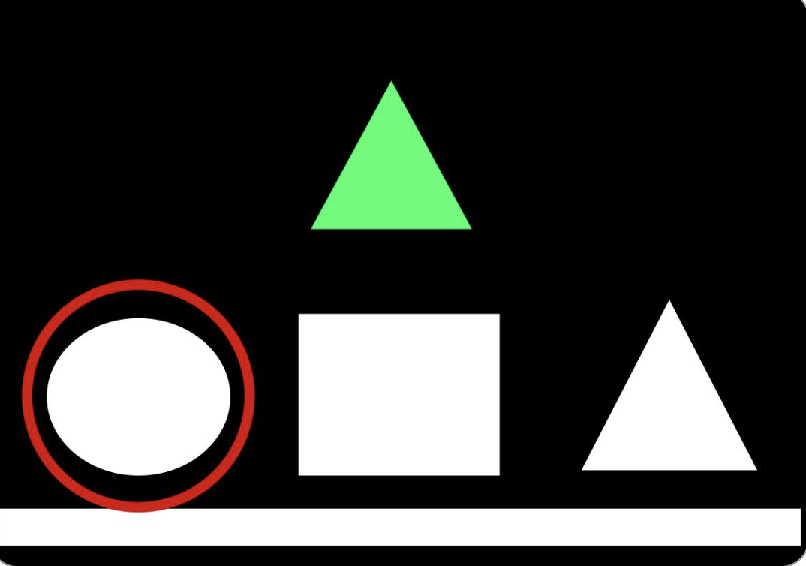
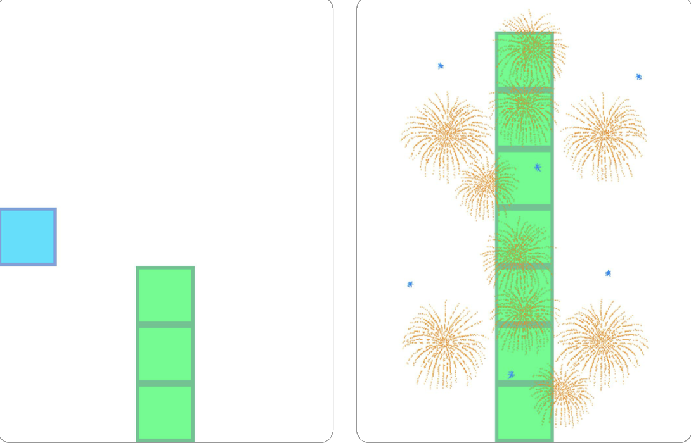

<table>
  <tr>
    <td width="50%">
      
    </td>
    <td width="50%">
      <h3> 2nd Place at 2025 RESNA Student Design Challenge</h3>
      <p>Switcharoo was recognized at the <a href="https://www.resna.org/Events/2025-RESNA-Conference/2025-Student-Design-Challenge-Winners">2025 RESNA Conference</a>, the leading conference for assistive technology researchers and engineers. </p>
      <p><strong>→</strong> <a href="Switcharoo-Research-Poster-32x40.pdf">View our research and app interface</a></p>
    </td>
  </tr>
</table>

---

## The Problem

Play is critical for child development but most games aren't designed for children have motor disabilities. These kids deserve fun, engaging experiences too.

Switcharoo is an educational game library built from the ground up for switch accessibility. We conducted ethnographic research at local schools and interviews with educators, then translated those insights into a cross platform React Native app featuring physics-based gameplay, haptic feedback, and external switch integration.

---

## Games

<table>
  <tr>
    <td align="center" width="33%">
      <br/>
      <strong>Pop the Balloon</strong><br/>
      <em>Cause & Effect</em><br/>
      <sub>Tap to pop balloons with animated feedback</sub>
    </td>
    <td align="center" width="33%">
      <br/>
      <strong>Stacking Blocks</strong><br/>
      <em>Classification</em><br/>
      <sub>Sort shapes with high-contrast mode support </sub>
    </td>
    <td align="center" width="33%">
      <br/>
      <strong>Sorting Game</strong><br/>
      <em>Timing</em><br/>
      <sub>Physics-based stacking with haptic feedback</sub>
    </td>
  </tr>
</table>

Coming soon: Treasure Hunt, Crossy Roads, Music Play

---

## Features

**Accessibility**
- External switch support via `react-native-keyevent`
- Automatic scanning patterns across interactive elements
- High contrast mode for visual accessibility
- Haptic feedback for tactile responses
- Screen tap fallback for users without switches

**Dashboard**
- Grid-based game library with large, color-coded tiles
- Single/Group player toggle
- Favorites system with quick access
- Game info modals showing learning themes & switch requirements
- Built-in help center with setup guides

---

## Getting Started

```bash
# Clone the repo
git clone https://github.com/your-username/huskyADAPT-sata.git
cd huskyADAPT-sata

# Install dependencies
npm install

# Start development server
npx expo start
```

Then press `i` for iOS, `a` for Android, or `w` for web.

---

## Tech Stack

| Category | Technologies |
|----------|-------------|
| **Framework** | React Native v0.76, Expo v52, TypeScript |
| **Styling** | NativeWind (Tailwind CSS), Expo Vector Icons |
| **Accessibility** | expo-haptics, react-native-keyevent, react-native-gesture-handler |
| **Games** | react-native-game-engine, @shopify/react-native-skia, react-native-reanimated |
| **Testing** | Jest, jest-expo, physical switch device validation |****

---

## Project Structure

```
app/
├── (games)/              # Game screens
├── index.tsx             # Library (home)
├── FavoritesScreen.tsx   # Saved games
├── SettingsScreen.tsx    # Accessibility settings
└── HelpScreen.tsx        # FAQ & troubleshooting

components/
├── GameTile.jsx          # Game selection cards
├── GameHeader.tsx        # In-game navigation
├── InfoScreen.jsx        # Game info modal
└── game_components/      # Game-specific UI

assets/
├── gamesData.json        # Game metadata
└── (games)/Assets/       # Game assets (images, sounds)
```

---

## Team

Built by students at the University of Washington:

Ella Cao, James Tran, Arshita Misra, Mishti Dhawan, Helen Liu, Sneha Birru
